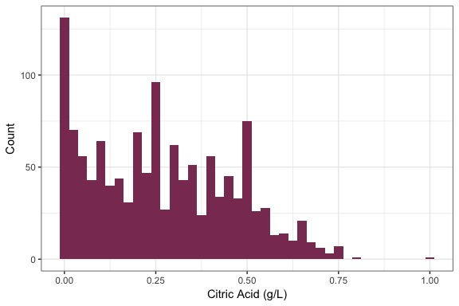
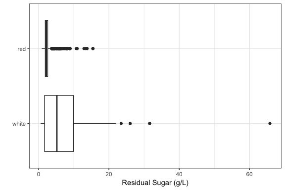
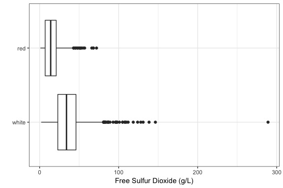
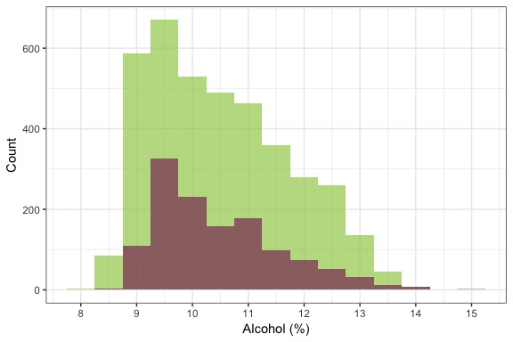
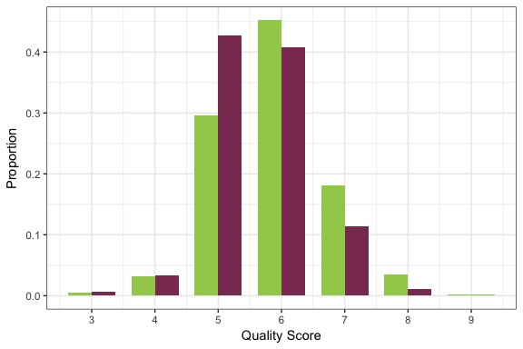
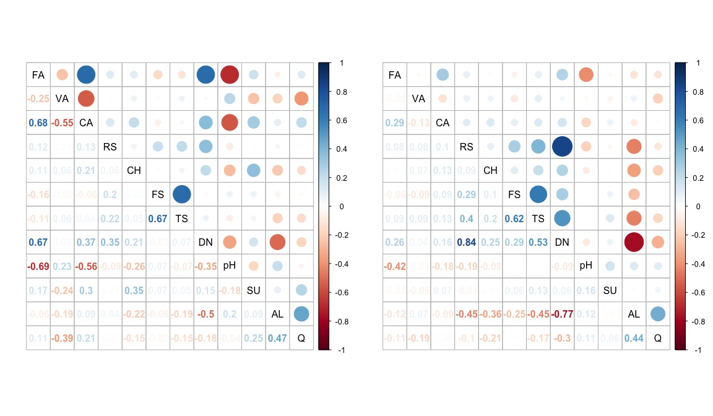
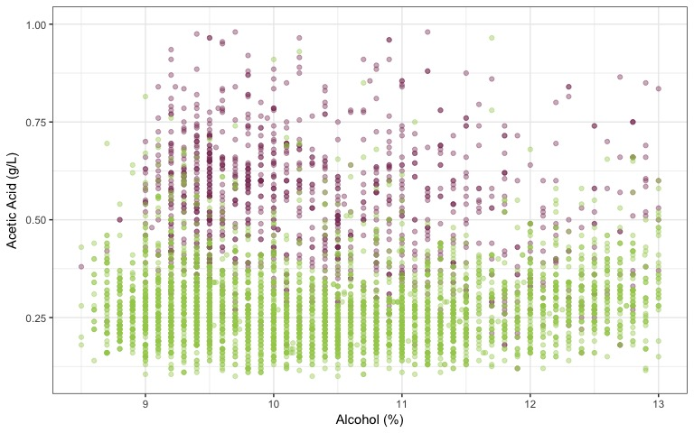

Red vs. White Wine
================
Jaclyn Rich
3/28/2018

-   [Data Overview](#data-overview)
    -   [Load the Data and Split into Training and Testing Sets](#load-the-data-and-split-into-training-and-testing-sets)
    -   [White Wine](#white-wine)
    -   [Red Wine](#red-wine)
    -   [Combined Data](#combined-data)
-   [Univariate Plots and Analysis](#univariate-plots-and-analysis)
    -   [Fixed Acidity](#fixed-acidity)
    -   [Volatile Acidity](#volatile-acidity)
    -   [Citric Acid](#citric-acid)
    -   [Residual Sugar](#residual-sugar)
    -   [Chlorides](#chlorides)
    -   [Free Sulfur Dioxide](#free-sulfur-dioxide)
    -   [Total Sulfur Dioxide](#total-sulfur-dioxide)
    -   [Density](#density)
    -   [pH](#ph)
    -   [Sulphates](#sulphates)
    -   [Percent Alcohol](#percent-alcohol)
    -   [Quality](#quality)
    -   [Summary](#summary)
-   [Bivariate Plots and Analysis](#bivariate-plots-and-analysis)
-   [Multivariate Plots and Analysis](#multivariate-plots-and-analysis)
-   [Final Plots and Summary](#final-plots-and-summary)
-   [Reflection](#reflection)

Data Overview
-------------

Data Source: P. Cortez, A. Cerdeira, F. Almeida, T. Matos and J. Reis. Modeling wine preferences by data mining from physicochemical properties. In Decision Support Systems, Elsevier, 47(4):547-553. ISSN: 0167-9236.

The data sets originally consisted of 1599 Portuguese red wines and 4898 white wines with 12 features and an index variable (X); neither data set has null values. All of the features besides quality, which is ordinal, are continuous. The data sets were joined for a total of 6497 wines and a color field was added. The purpose of this report is to explore the chemical properties that distinguish red and white wines.

Features:

-   fixed.acidity: the amount of nonvolatile (tartaric) acid
    -   nonvolatile acids do not evaporate readily
-   volatile.acidity: the amount of volatile (acetic) acid
    -   higher levels will result in a distasteful, vinegary taste
-   citric.acid: the amount of citric acid
    -   adds a "freshness" and flavor to wines
    -   found in small quantities
-   residual.sugar: quantity of sugar remaining after the fermentation process is finished
    -   wines with more than 45 grams/liter are considered sweet
-   chlorides: quantity of salt
-   free.sulfur.dioxide: the amount of the free form of sulfur dioxide
    -   the free form exists in equilibrium between molecular sulfur dioxide (as a dissolved gas) and bisulfite ion
    -   it prevents microbial growth and oxidation of the wine
-   total.sulfur.dioxide: the amount of free and bound forms of sulfur dioxide
    -   in low amounts it is usually not noticeable
    -   in higher amounts it is apparent in the nose and taste of the wine
-   density: mass per unit of volume
-   pH: describes how acidic or basic the wine is
    -   pH scale goes from 0 (most acidic) to 14 (most basic)
-   sulphates: the amount of potassium sulphate
    -   potassium sulphate is a antimicrobial and antioxidant additive which can contribute to sulfur dioxide gas levels
-   alcohol: the percent volume of alcohol
-   quality: score between 0 (worst) and 10 (best)
    -   three independent taste testers rated each wine
    -   the median score was chosen as the quality

The amounts are in grams per liter.

### Load the Data and Split into Training and Testing Sets

    ## [1] 4898   13

    ## [1] 1599   13

    ## [1] 6497   13

The data is split into training and testing sets, stratified to maintain the same ratio of red to white wines in both, so that a model may be built later to classify a wine as red or white. The test set contains 20% of the data points. The training set will be used for exploration in this notebook. The train and test sets are saved as csvs and will be used in a separate Jupyter Notebook that creates and evaluates a classification model.

### White Wine

    ## [1] 3919   12

    ## 'data.frame':    3919 obs. of  12 variables:
    ##  $ fixed.acidity       : num  6.3 8.1 7.2 7.2 8.1 7 8.1 8.1 7.9 8.3 ...
    ##  $ volatile.acidity    : num  0.3 0.28 0.23 0.23 0.28 0.27 0.22 0.27 0.18 0.42 ...
    ##  $ citric.acid         : num  0.34 0.4 0.32 0.32 0.4 0.36 0.43 0.41 0.37 0.62 ...
    ##  $ residual.sugar      : num  1.6 6.9 8.5 8.5 6.9 ...
    ##  $ chlorides           : num  0.049 0.05 0.058 0.058 0.05 0.045 0.044 0.033 0.04 0.04 ...
    ##  $ free.sulfur.dioxide : num  14 30 47 47 30 45 28 11 16 41 ...
    ##  $ total.sulfur.dioxide: num  132 97 186 186 97 170 129 63 75 172 ...
    ##  $ density             : num  0.994 0.995 0.996 0.996 0.995 ...
    ##  $ pH                  : num  3.3 3.26 3.19 3.19 3.26 3 3.22 2.99 3.18 2.98 ...
    ##  $ sulphates           : num  0.49 0.44 0.4 0.4 0.44 0.45 0.45 0.56 0.63 0.67 ...
    ##  $ alcohol             : num  9.5 10.1 9.9 9.9 10.1 8.8 11 12 10.8 9.7 ...
    ##  $ quality             : int  6 6 6 6 6 6 6 5 5 5 ...

    ##  fixed.acidity    volatile.acidity  citric.acid     residual.sugar  
    ##  Min.   : 3.900   Min.   :0.0800   Min.   :0.0000   Min.   : 0.600  
    ##  1st Qu.: 6.300   1st Qu.:0.2100   1st Qu.:0.2700   1st Qu.: 1.700  
    ##  Median : 6.800   Median :0.2600   Median :0.3200   Median : 5.200  
    ##  Mean   : 6.856   Mean   :0.2784   Mean   :0.3349   Mean   : 6.426  
    ##  3rd Qu.: 7.300   3rd Qu.:0.3200   3rd Qu.:0.3900   3rd Qu.: 9.900  
    ##  Max.   :14.200   Max.   :1.0050   Max.   :1.2300   Max.   :65.800  
    ##    chlorides       free.sulfur.dioxide total.sulfur.dioxide
    ##  Min.   :0.00900   Min.   :  2.00      Min.   : 10.0       
    ##  1st Qu.:0.03600   1st Qu.: 23.00      1st Qu.:108.0       
    ##  Median :0.04300   Median : 34.00      Median :134.0       
    ##  Mean   :0.04574   Mean   : 35.33      Mean   :138.2       
    ##  3rd Qu.:0.05000   3rd Qu.: 46.00      3rd Qu.:167.0       
    ##  Max.   :0.34600   Max.   :289.00      Max.   :440.0       
    ##     density             pH          sulphates         alcohol     
    ##  Min.   :0.9871   Min.   :2.720   Min.   :0.2200   Min.   : 8.00  
    ##  1st Qu.:0.9917   1st Qu.:3.080   1st Qu.:0.4100   1st Qu.: 9.50  
    ##  Median :0.9938   Median :3.180   Median :0.4700   Median :10.40  
    ##  Mean   :0.9940   Mean   :3.188   Mean   :0.4902   Mean   :10.51  
    ##  3rd Qu.:0.9961   3rd Qu.:3.280   3rd Qu.:0.5500   3rd Qu.:11.40  
    ##  Max.   :1.0390   Max.   :3.820   Max.   :1.0800   Max.   :14.00  
    ##     quality     
    ##  Min.   :3.000  
    ##  1st Qu.:5.000  
    ##  Median :6.000  
    ##  Mean   :5.885  
    ##  3rd Qu.:6.000  
    ##  Max.   :9.000

    ##      fixed.acidity volatile.acidity citric.acid residual.sugar chlorides
    ## 1601           6.3             0.30        0.34            1.6     0.049
    ## 1602           8.1             0.28        0.40            6.9     0.050
    ## 1603           7.2             0.23        0.32            8.5     0.058
    ## 1604           7.2             0.23        0.32            8.5     0.058
    ## 1605           8.1             0.28        0.40            6.9     0.050
    ## 1607           7.0             0.27        0.36           20.7     0.045
    ##      free.sulfur.dioxide total.sulfur.dioxide density   pH sulphates
    ## 1601                  14                  132  0.9940 3.30      0.49
    ## 1602                  30                   97  0.9951 3.26      0.44
    ## 1603                  47                  186  0.9956 3.19      0.40
    ## 1604                  47                  186  0.9956 3.19      0.40
    ## 1605                  30                   97  0.9951 3.26      0.44
    ## 1607                  45                  170  1.0010 3.00      0.45
    ##      alcohol quality
    ## 1601     9.5       6
    ## 1602    10.1       6
    ## 1603     9.9       6
    ## 1604     9.9       6
    ## 1605    10.1       6
    ## 1607     8.8       6

### Red Wine

    ## [1] 1280   12

    ## 'data.frame':    1280 obs. of  12 variables:
    ##  $ fixed.acidity       : num  7.4 7.8 7.8 11.2 7.4 7.4 7.3 7.8 7.5 6.7 ...
    ##  $ volatile.acidity    : num  0.7 0.88 0.76 0.28 0.7 0.66 0.65 0.58 0.5 0.58 ...
    ##  $ citric.acid         : num  0 0 0.04 0.56 0 0 0 0.02 0.36 0.08 ...
    ##  $ residual.sugar      : num  1.9 2.6 2.3 1.9 1.9 1.8 1.2 2 6.1 1.8 ...
    ##  $ chlorides           : num  0.076 0.098 0.092 0.075 0.076 0.075 0.065 0.073 0.071 0.097 ...
    ##  $ free.sulfur.dioxide : num  11 25 15 17 11 13 15 9 17 15 ...
    ##  $ total.sulfur.dioxide: num  34 67 54 60 34 40 21 18 102 65 ...
    ##  $ density             : num  0.998 0.997 0.997 0.998 0.998 ...
    ##  $ pH                  : num  3.51 3.2 3.26 3.16 3.51 3.51 3.39 3.36 3.35 3.28 ...
    ##  $ sulphates           : num  0.56 0.68 0.65 0.58 0.56 0.56 0.47 0.57 0.8 0.54 ...
    ##  $ alcohol             : num  9.4 9.8 9.8 9.8 9.4 9.4 10 9.5 10.5 9.2 ...
    ##  $ quality             : int  5 5 5 6 5 5 7 7 5 5 ...

    ##  fixed.acidity    volatile.acidity  citric.acid     residual.sugar  
    ##  Min.   : 4.600   Min.   :0.1200   Min.   :0.0000   Min.   : 0.900  
    ##  1st Qu.: 7.100   1st Qu.:0.4000   1st Qu.:0.0900   1st Qu.: 1.900  
    ##  Median : 7.900   Median :0.5200   Median :0.2500   Median : 2.200  
    ##  Mean   : 8.289   Mean   :0.5283   Mean   :0.2661   Mean   : 2.534  
    ##  3rd Qu.: 9.200   3rd Qu.:0.6362   3rd Qu.:0.4200   3rd Qu.: 2.600  
    ##  Max.   :15.900   Max.   :1.5800   Max.   :1.0000   Max.   :15.500  
    ##    chlorides       free.sulfur.dioxide total.sulfur.dioxide
    ##  Min.   :0.01200   Min.   : 1.00       Min.   :  6.00      
    ##  1st Qu.:0.07000   1st Qu.: 7.00       1st Qu.: 22.00      
    ##  Median :0.07900   Median :14.00       Median : 38.00      
    ##  Mean   :0.08684   Mean   :15.92       Mean   : 46.55      
    ##  3rd Qu.:0.09000   3rd Qu.:21.00       3rd Qu.: 61.00      
    ##  Max.   :0.61100   Max.   :72.00       Max.   :289.00      
    ##     density             pH          sulphates         alcohol     
    ##  Min.   :0.9901   Min.   :2.740   Min.   :0.3700   Min.   : 8.40  
    ##  1st Qu.:0.9955   1st Qu.:3.210   1st Qu.:0.5500   1st Qu.: 9.50  
    ##  Median :0.9967   Median :3.310   Median :0.6200   Median :10.20  
    ##  Mean   :0.9967   Mean   :3.312   Mean   :0.6556   Mean   :10.43  
    ##  3rd Qu.:0.9979   3rd Qu.:3.400   3rd Qu.:0.7300   3rd Qu.:11.10  
    ##  Max.   :1.0037   Max.   :4.010   Max.   :2.0000   Max.   :14.90  
    ##     quality     
    ##  Min.   :3.000  
    ##  1st Qu.:5.000  
    ##  Median :6.000  
    ##  Mean   :5.621  
    ##  3rd Qu.:6.000  
    ##  Max.   :8.000

    ##   fixed.acidity volatile.acidity citric.acid residual.sugar chlorides
    ## 1           7.4             0.70        0.00            1.9     0.076
    ## 2           7.8             0.88        0.00            2.6     0.098
    ## 3           7.8             0.76        0.04            2.3     0.092
    ## 4          11.2             0.28        0.56            1.9     0.075
    ## 5           7.4             0.70        0.00            1.9     0.076
    ## 6           7.4             0.66        0.00            1.8     0.075
    ##   free.sulfur.dioxide total.sulfur.dioxide density   pH sulphates alcohol
    ## 1                  11                   34  0.9978 3.51      0.56     9.4
    ## 2                  25                   67  0.9968 3.20      0.68     9.8
    ## 3                  15                   54  0.9970 3.26      0.65     9.8
    ## 4                  17                   60  0.9980 3.16      0.58     9.8
    ## 5                  11                   34  0.9978 3.51      0.56     9.4
    ## 6                  13                   40  0.9978 3.51      0.56     9.4
    ##   quality
    ## 1       5
    ## 2       5
    ## 3       5
    ## 4       6
    ## 5       5
    ## 6       5

### Combined Data

    ## [1] 5199   13

    ## 'data.frame':    5199 obs. of  13 variables:
    ##  $ fixed.acidity       : num  7.4 7.8 7.8 11.2 7.4 7.4 7.3 7.8 7.5 6.7 ...
    ##  $ volatile.acidity    : num  0.7 0.88 0.76 0.28 0.7 0.66 0.65 0.58 0.5 0.58 ...
    ##  $ citric.acid         : num  0 0 0.04 0.56 0 0 0 0.02 0.36 0.08 ...
    ##  $ residual.sugar      : num  1.9 2.6 2.3 1.9 1.9 1.8 1.2 2 6.1 1.8 ...
    ##  $ chlorides           : num  0.076 0.098 0.092 0.075 0.076 0.075 0.065 0.073 0.071 0.097 ...
    ##  $ free.sulfur.dioxide : num  11 25 15 17 11 13 15 9 17 15 ...
    ##  $ total.sulfur.dioxide: num  34 67 54 60 34 40 21 18 102 65 ...
    ##  $ density             : num  0.998 0.997 0.997 0.998 0.998 ...
    ##  $ pH                  : num  3.51 3.2 3.26 3.16 3.51 3.51 3.39 3.36 3.35 3.28 ...
    ##  $ sulphates           : num  0.56 0.68 0.65 0.58 0.56 0.56 0.47 0.57 0.8 0.54 ...
    ##  $ alcohol             : num  9.4 9.8 9.8 9.8 9.4 9.4 10 9.5 10.5 9.2 ...
    ##  $ quality             : int  5 5 5 6 5 5 7 7 5 5 ...
    ##  $ color               : Factor w/ 2 levels "red","white": 1 1 1 1 1 1 1 1 1 1 ...

    ##  fixed.acidity    volatile.acidity  citric.acid    residual.sugar  
    ##  Min.   : 3.900   Min.   :0.08     Min.   :0.000   Min.   : 0.600  
    ##  1st Qu.: 6.400   1st Qu.:0.23     1st Qu.:0.240   1st Qu.: 1.800  
    ##  Median : 7.000   Median :0.29     Median :0.310   Median : 3.000  
    ##  Mean   : 7.209   Mean   :0.34     Mean   :0.318   Mean   : 5.468  
    ##  3rd Qu.: 7.700   3rd Qu.:0.41     3rd Qu.:0.390   3rd Qu.: 8.200  
    ##  Max.   :15.900   Max.   :1.58     Max.   :1.230   Max.   :65.800  
    ##    chlorides       free.sulfur.dioxide total.sulfur.dioxide
    ##  Min.   :0.00900   Min.   :  1.00      Min.   :  6.0       
    ##  1st Qu.:0.03800   1st Qu.: 17.00      1st Qu.: 77.0       
    ##  Median :0.04700   Median : 29.00      Median :118.0       
    ##  Mean   :0.05586   Mean   : 30.55      Mean   :115.7       
    ##  3rd Qu.:0.06400   3rd Qu.: 41.00      3rd Qu.:155.0       
    ##  Max.   :0.61100   Max.   :289.00      Max.   :440.0       
    ##     density             pH          sulphates        alcohol     
    ##  Min.   :0.9871   Min.   :2.720   Min.   :0.220   Min.   : 8.00  
    ##  1st Qu.:0.9923   1st Qu.:3.110   1st Qu.:0.430   1st Qu.: 9.50  
    ##  Median :0.9949   Median :3.210   Median :0.510   Median :10.30  
    ##  Mean   :0.9947   Mean   :3.218   Mean   :0.531   Mean   :10.49  
    ##  3rd Qu.:0.9970   3rd Qu.:3.320   3rd Qu.:0.600   3rd Qu.:11.30  
    ##  Max.   :1.0390   Max.   :4.010   Max.   :2.000   Max.   :14.90  
    ##     quality       color     
    ##  Min.   :3.00   red  :1280  
    ##  1st Qu.:5.00   white:3919  
    ##  Median :6.00               
    ##  Mean   :5.82               
    ##  3rd Qu.:6.00               
    ##  Max.   :9.00

    ##      fixed.acidity volatile.acidity citric.acid residual.sugar chlorides
    ## 5742           5.9            0.270        0.27           9.00     0.051
    ## 6159           6.9            0.220        0.32           9.30     0.040
    ## 2086           6.0            0.160        0.37           1.50     0.025
    ## 1166           8.5            0.440        0.50           1.90     0.369
    ## 981            9.1            0.500        0.30           1.90     0.065
    ## 736            7.7            0.965        0.10           2.10     0.112
    ## 3045           8.3            0.200        0.74           4.45     0.044
    ## 5275           5.6            0.250        0.19           2.40     0.049
    ## 5634           6.8            0.270        0.22          17.80     0.034
    ## 409           10.4            0.340        0.58           3.70     0.174
    ##      free.sulfur.dioxide total.sulfur.dioxide density   pH sulphates
    ## 5742                  43                  136 0.99410 3.25      0.53
    ## 6159                  22                  110 0.99580 3.34      0.54
    ## 2086                  43                  117 0.99280 3.46      0.51
    ## 1166                  15                   38 0.99634 3.01      1.10
    ## 981                    8                   17 0.99774 3.32      0.71
    ## 736                   11                   22 0.99630 3.26      0.50
    ## 3045                  33                  130 0.99240 3.25      0.42
    ## 5275                  42                  166 0.99200 3.25      0.43
    ## 5634                  16                  116 0.99890 3.07      0.53
    ## 409                    6                   16 0.99700 3.19      0.70
    ##      alcohol quality color
    ## 5742    10.7       6 white
    ## 6159    10.7       7 white
    ## 2086     9.7       6 white
    ## 1166     9.4       5   red
    ## 981     10.5       6   red
    ## 736      9.5       5   red
    ## 3045    12.2       6 white
    ## 5275    10.4       6 white
    ## 5634     9.2       5 white
    ## 409     11.3       6   red

It is worth noting that there are 1177 duplicated records in the combined data set. The original paper did not remove these duplicate records. I have also kept the repeated rows, since from the description of the data it seems as though each row is a distinct variety, and removing them would no longer make this data set reflective of the prevalence of certain wines; if certain characteristics of wine are more common, then this frequency should be reflected in the data set.

Additionally, there are more than three times as many white wines than red wines in the data. This is important to keep in mind when training for classification based on color.

    ## [1] 1177

Univariate Plots and Analysis
-----------------------------

### Fixed Acidity

Note that for all displays of summary statistics, the red wines will appear on top and that for all univariate and bivariate plots (except the scatter matrix) red wine data is shown in plum purple and white wine data is shown in a light green.

    ##    Min. 1st Qu.  Median    Mean 3rd Qu.    Max. 
    ##   4.600   7.100   7.900   8.289   9.200  15.900

    ##    Min. 1st Qu.  Median    Mean 3rd Qu.    Max. 
    ##   3.900   6.300   6.800   6.856   7.300  14.200

Since the counts for red wine are so much lower, I plotted them separately below.

    ## 
    ##   (3,4]   (4,5]   (5,6]   (6,7]   (7,8]   (8,9]  (9,10] (10,11] (11,12] 
    ##       0       7      52     244     399     229     153      84      64 
    ## (12,13] (13,14] (14,15] (15,16] 
    ##      32      11       1       4

    ## 
    ##   (3,4]   (4,5]   (5,6]   (6,7]   (7,8]   (8,9]  (9,10] (10,11] (11,12] 
    ##       1      41     572    1867    1126     252      57       2       0 
    ## (12,13] (13,14] (14,15] (15,16] 
    ##       0       0       1       0

The distribution of the fixed acidity for red wines is slightly skewed to the right, with the last quartile being much more spread out than the other three. The mass of the data lies between 7 and 8.5, with all of the values between 4.6 and 15.9. There are only a few values greater than 14, although they do pull the mean up slightly.

The distribution of the fixed acidity for white wines is much more symmetric, with only a handful of data points lying above 10. The mass of the data lies between 6 and 7.5. It is clear that the fixed acidity for red wines is more spread out than that of white wines, and is generally lower.

### Volatile Acidity

    ##    Min. 1st Qu.  Median    Mean 3rd Qu.    Max. 
    ##  0.1200  0.4000  0.5200  0.5283  0.6362  1.5800

    ##    Min. 1st Qu.  Median    Mean 3rd Qu.    Max. 
    ##  0.0800  0.2100  0.2600  0.2784  0.3200  1.0050

Once again the white wines have a much more clustered distribution as compared with the red; since the mass of the data occurs in such a small range, many of the larger values are shown as outliers on the boxplot. Overall the red wines have more volatile acid than the whites; this discrepancy is much more marked than that of fixed acid levels. Since the data was long-tailed and the data is spread over more than an order of magnitude, I also plotted it on a log base 10 scale, where it looks normally distributed.

### Citric Acid

    ##    Min. 1st Qu.  Median    Mean 3rd Qu.    Max. 
    ##  0.0000  0.0900  0.2500  0.2661  0.4200  1.0000

    ##    Min. 1st Qu.  Median    Mean 3rd Qu.    Max. 
    ##  0.0000  0.2700  0.3200  0.3349  0.3900  1.2300

The data for white wine is fairly symmetric, with a slightly longer tail on the right side. We can see from the histogram and the small box on the box and whisker plot that most of the data lies within a small range (about 0.25 - 0.4). This also means that many of the lower and high-valued points are considered outliers.

The mass of the red wine data is much more spread out and all of the data has a smaller range than the white wine. The histogram shows three tall spikes, around 0, 0.25, and 0.50. More than 8% of the data points have 0 grams of citric acid per liter. All of the data points are less than 0.8, except for one outlier which has 1 g/L.

    ## [1] 0.08203125

Red wine has lower levels of citric acid than white wine; about 50% of the red wines have more than 0.25 g/L, whereas about 75% of white wines have more than that.

### Residual Sugar

    ##    Min. 1st Qu.  Median    Mean 3rd Qu.    Max. 
    ##   0.900   1.900   2.200   2.534   2.600  15.500

    ##    Min. 1st Qu.  Median    Mean 3rd Qu.    Max. 
    ##   0.600   1.700   5.200   6.426   9.900  65.800

We can clearly see white wines are vastly sweeter than reds overall. There is one sweet white wine (defined as greater than 45 g/L) with 65.8 g/L. Some of the larger values and all outliers for the white wine were excluded from the histogram below in order to get a better look at the data.

Red and white wines each have a large peak around 2-2.5. While after this peak, red wines decrease rapidly and have a very long tail, white wines decrease, but maintain a higher level of sweeter wines. Even after a log10 transformation of the x-axis, the distribution of residual sugar in red wines is still slightly skewed to the right. The transformation condenses the right side of the white wines data into one mass, making the data look bimodal.

### Chlorides

    ##    Min. 1st Qu.  Median    Mean 3rd Qu.    Max. 
    ## 0.01200 0.07000 0.07900 0.08684 0.09000 0.61100

    ##    Min. 1st Qu.  Median    Mean 3rd Qu.    Max. 
    ## 0.00900 0.03600 0.04300 0.04574 0.05000 0.34600

White wines have lower levels of chlorides in general; most white wines have less than 0.07 grams of chlorides per liter, where as 75% of reds have greater than this amount. Chloride distributions for both colors are very clustered, but with a significant number of outliers, and some lying very far away from the mass of the data. Even after a log transformation both distributions are very long tailed. Additionally, the scale also emphasizes some of the lower values.

### Free Sulfur Dioxide

    ##    Min. 1st Qu.  Median    Mean 3rd Qu.    Max. 
    ##    1.00    7.00   14.00   15.92   21.00   72.00

    ##    Min. 1st Qu.  Median    Mean 3rd Qu.    Max. 
    ##    2.00   23.00   34.00   35.33   46.00  289.00

The distribution for red wines has a much smaller range and fewer outliers than that of the whites. White wines also have one outlier at 239 that is more than 100 g/L greater than the next largest value. Red wines have much less sulfur dioxide; more than 75% of reds have less than 23 g/L, while whites have only 25% of points below this value.

### Total Sulfur Dioxide

    ##    Min. 1st Qu.  Median    Mean 3rd Qu.    Max. 
    ##    6.00   22.00   38.00   46.55   61.00  289.00

    ##    Min. 1st Qu.  Median    Mean 3rd Qu.    Max. 
    ##    10.0   108.0   134.0   138.2   167.0   440.0

The distributions for total sulfur dioxide look drastically different from each other, although they do look somewhat similar to those for free sulfur dioxide. The distribution for white wines looks normal, with some high outliers. The distribution for red wines is skewed to the right, also with a few outliers. Overall, white wines have much higher levels of sulfur dioxide with almost all the red wines having less sulfur dioxide than 50% of white wines.

### Density

    ##    Min. 1st Qu.  Median    Mean 3rd Qu.    Max. 
    ##  0.9901  0.9955  0.9967  0.9967  0.9979  1.0040

    ##    Min. 1st Qu.  Median    Mean 3rd Qu.    Max. 
    ##  0.9871  0.9917  0.9938  0.9940  0.9961  1.0390

Red wines are more dense than white wines overall, although there are some large outliers for the density of white wines. Even though the range for white wines is larger, it still very small at only 0.0519. It is worth noting that most wines are slightly less dense than water, which has a density of 1.

### pH

    ##    Min. 1st Qu.  Median    Mean 3rd Qu.    Max. 
    ##   2.740   3.210   3.310   3.312   3.400   4.010

    ##    Min. 1st Qu.  Median    Mean 3rd Qu.    Max. 
    ##   2.720   3.080   3.180   3.188   3.280   3.820

The shapes of the distributions for white and red wine pHs look very similar, but with the reds shifted slightly higher. This indicates that red wines are slightly more basic and white wines are slightly more acidic. Both distributions have tails on both ends, and look approximately normally distributed.

### Sulphates

    ##    Min. 1st Qu.  Median    Mean 3rd Qu.    Max. 
    ##  0.3700  0.5500  0.6200  0.6556  0.7300  2.0000

    ##    Min. 1st Qu.  Median    Mean 3rd Qu.    Max. 
    ##  0.2200  0.4100  0.4700  0.4902  0.5500  1.0800

The boxplots for both distributions look very similar, although red wines have more significant outliers. White wines are log-normal, but red wines still have high values after the log transformation. White wines also have less sulphates than red wines, with 75% of white wines having less than 0.55 g/L, and only 25% of red wines having less than this amount.

### Percent Alcohol

    ##    Min. 1st Qu.  Median    Mean 3rd Qu.    Max. 
    ##    8.40    9.50   10.20   10.43   11.10   14.90

    ##    Min. 1st Qu.  Median    Mean 3rd Qu.    Max. 
    ##    8.00    9.50   10.40   10.51   11.40   14.00

The shapes of the distributions for the percent alcohol in red and white wines are practically identical. They both peak around 9.5 and have very similar means and quartiles. The distribution for red wines have a slightly longer tail and a few outliers.

### Quality

    ##    Min. 1st Qu.  Median    Mean 3rd Qu.    Max. 
    ##   3.000   5.000   6.000   5.621   6.000   8.000

    ##    Min. 1st Qu.  Median    Mean 3rd Qu.    Max. 
    ##   3.000   5.000   6.000   5.885   6.000   9.000

We can see that red and white wines have very similar proportions for wines with quality scores of 3 and 4. Red wines in this data set are of slightly lower quality; they have a greater proportion of wines with a score of 5 and a lower portion that are scored 6, 7, and 8, as compared with whites. Additionally, the maximum quality score for white wines is 9, whereas the highest score awarded to a red wine is 8.

### Summary

For red vs. white wine classification, it is important to know which variables most clearly split the data according to color. We can see that the values for volatile acidity, residual sugar, chlorides, and total sulfur dioxide show the most clear distinction between the colors. These variables are the most likely to be included in a future classification model.

Bivariate Plots and Analysis
----------------------------

Unsurprisingly the two variables with the strongest correlation are free sulfur dioxide and total sulfur dioxide at 0.72. The next strongest relationship is a negative one between density and percent alcohol at -0.68. Residual sugar and density also have a moderately strong relationship with a correlation of 0.56 It is also interesting to note that quality has the strongest positive relationship with percent alcohol and negative relationships with density and volatile acidity. It is important that we know which variables in the data are strongly correlated in case we want to perform a regression.

When we look at the correlations between variables for each color we can see some relationships not apparent when we looked at the relationships regardless of wine color. Both red and white wines have a strong negative relationship between pH and quality, meaning the as the pH increases, or the wine becomes more basic, the quality decreases. For white wines the strongest relationship is between residual sugar and density, at 0.84; this relationship was was much weaker in the aggregated correlation matrix, with a correlation of 0.56 between these variables. Red wines have much stronger relationships between volatile acidity and other variables as compared with white wines; residual sugar and pH have moderately strong positive relationships with volatile acidity, and sulphates have a moderately strong negative one with it.

In order to aid in classification according to wine color, it will be most helpful to find pairs of variables that show the greatest separation between the classes.

The scatterplots above are not centered around the mass of the data because of outliers. Note that the axis dimensions for the individual scatterplots below were altered in order to feature the majority of the data.

All of the scatterplots shown display fairly strong clustering of wine by color; the two classes are fairly well separated, but none are linearly separable. In most of the plots there are some white wines that are interspersed throughout the red wines, while red wines that are not within their own cluster do not extend too far into the white wine cluster. Unsurprisingly, the variables that show the best class separation in univariate plots also do so when combined with other variables in the bivariate plots. From these plots we can see that the interaction of some of the variables together could be very useful in a classification model.

Multivariate Plots and Analysis
-------------------------------

In the plots above we can see that white wines have a much greater variation in residual sugar as compared with red wines; there are only a few sweeter red wines in the data. We can also see that for white wines that the wines with less alcohol have more residual sugar. However, sugar does not vary as consistently with the total sulfur dioxide, The sweetest white wines have higher levels of sulfur dioxide, however sugar levels do not vary as consistently along total sulfur dioxide as they do along percent alcohol.

    ## [1] 53

The data was subsetted to trim the top 1% (53) of data points according to residual sugar, since the outliers were not allowing the plot to show the full range of color.

The change in residual sugar is that much more striking according to density. The more dense the wine, the more residual sugar in it. Additionally we can see that only red wines with a density greater than 0.995 have higher levels of sugar.

White wines with greater total sulfur dioxide have greater densities, however most red wines have much lower levels of total sulfur dioxide, yet still attain high levels of density.

The strongest correlation between variables is between alcohol and density. We can also clearly see that white wines with the greatest density and percent alcohol have the highest levels of residual sugar. While this correlation is not as strong in red wines and residual sugar does not vary along alcohol and density as it does in whites, there is a small group of reds with low alcohol and high density that have a high amount of residual sugar.

Final Plots and Summary
-----------------------

Total sulfur dioxide shows the greatest separation of sulfur dioxide by class. We can clearly see that here is not a huge overlap between the colors and that white wines have a normal distribution and reds are skewed to the right. This plot indicates that this variable could be used successfully in a classification model based on color.

Although there are some red and white wines interspersed around clusters of the opposite color, the two classes show a distinct and clear separation with a fairly wide margin. This plot indicates that these two variables could be used successfully in a classification model based on color.

This plot shows that while density and alcohol alone are not enough to show a separation based on wine color, the addition of residual sugar would help to explain the differences in red and white wines.

Reflection
----------

I started by trying to understand each individual variable across red and white wines to see if it would be feasible to eventually create a classifier for color. Using the results of the univariate plots and the scatterplot matrix, I then explored two variables at a time to see if this would increase the distinction between red and white wines. Finally I investigated three variables at a time to see how they interact and separate the classes. I was pleasantly surprised that the red and white wines showed such clear clusters in many of the bivariate plots. I also explored the relationship between the chemical properties of the wine and quality, and unfortunately the relationships were not nearly as strong. Additionally, classifying based on quality or a rating class (e.g. 3-4 = poor, 5-6 = good, 7-9 = excellent) is a much more difficult task owing to the fact that good wines vastly outnumber poor and excellent wines

As aforementioned there are wines with with duplicate properties which could inflate measures of accuracy for any future classification models. Additionally, conclusions from these explorations and future classification tasks would be limited since the data set only contains a sample of Portuguese wines. It would be interesting to explore if these relationships held up when using a data set with wines from around the world.
